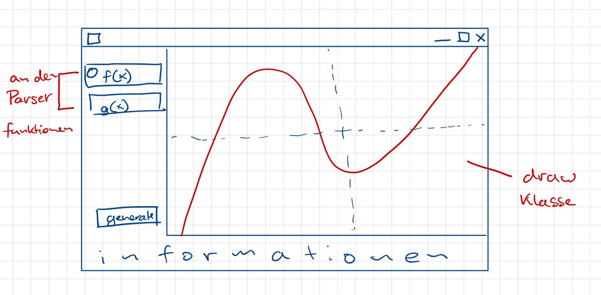

# Funktionsplot_aop
Exam project second semester.

## ToDo (copied from original task):
- Deckblatt (mögliche Formate: doc, docx, odt, kein pdf)
- Kurzanleitung zur Bedienung (mögliche Formate: doc, docx, odt, pdf)
- Entwurfsskizze (wenige Seiten) (mögliche Formate doc, docx, odt, pdf)
− Testbeispiele (mögliche Formate doc, docx, odt, pdf)

## Planned GUI

## Actual GUI

